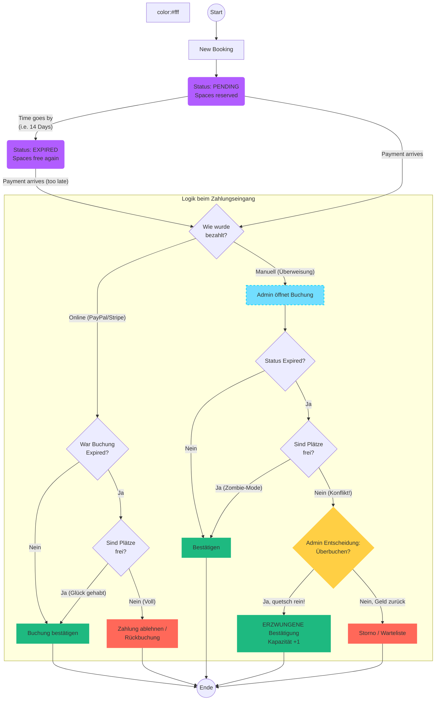

```mermaid
flowchart TD
    %% Nodes styling
    classDef state fill:#b15dff,stroke:#b15dff,stroke-width:2px,color:#fff!important;
    classDef success fill:#1eb980,stroke:#1eb980,stroke-width:2px;color:#fff;
    classDef warning fill:#ffcf44,stroke:#856404,stroke-width:0px;
    classDef danger fill:#ff6859,stroke:#ff6859,stroke-width:2px;
    classDef admin fill:#72deff,stroke:#00d4ff,stroke-width:2px,stroke-dasharray: 5 5;

    Start((Start)) --> NewBooking[New Booking]
    NewBooking --> Pending(Status: PENDING<br/>Spaces reserved):::state
    
    %% Expiration Logic
    Pending -- "Time goes by<br/>(i.e. 14 Days)" --> Expired(Status: EXPIRED<br/>Spaces free again):::state

    %% Payment Trigger
    Pending -- "Payment arrives" --> PaymentProcess
    Expired -- "Payment arrives (too late)" --> PaymentProcess

    subgraph PaymentLogic [Logik beim Zahlungseingang]
        PaymentProcess{Wie wurde<br/>bezahlt?}
        
        %% ONLINE WAY
        PaymentProcess -- "Online (PayPal/Stripe)" --> IsExpOnline{War Buchung<br/>Expired?}
        IsExpOnline -- Nein --> ConfirmOnline[Buchung bestätigen]:::success
        IsExpOnline -- Ja --> CheckSpaceOnline{Sind Plätze<br/>frei?}
        
        CheckSpaceOnline -- "Ja (Glück gehabt)" --> ConfirmOnline
        CheckSpaceOnline -- "Nein (Voll)" --> RejectOnline[Zahlung ablehnen /<br/>Rückbuchung]:::danger
        
        %% MANUAL WAY
        PaymentProcess -- "Manuell (Überweisung)" --> AdminCheck[Admin öffnet Buchung]:::admin
        AdminCheck --> IsExpManual{Status Expired?}
        
        IsExpManual -- Nein --> ConfirmManual[Bestätigen]:::success
        IsExpManual -- Ja --> CheckSpaceManual{Sind Plätze<br/>frei?}
        
        CheckSpaceManual -- "Ja (Zombie-Mode)" --> ConfirmManual
        CheckSpaceManual -- "Nein (Konflikt!)" --> OverbookingDecision{Admin Entscheidung:<br/>Überbuchen?}:::warning
        
        OverbookingDecision -- "Ja, quetsch rein!" --> ForceConfirm[ERZWUNGENE Bestätigung<br/>Kapazität +1]:::success
        OverbookingDecision -- "Nein, Geld zurück" --> ManualReject[Storno / Warteliste]:::danger
    end

    ConfirmOnline --> End((Ende))
    ConfirmManual --> End
    ForceConfirm --> End
    RejectOnline --> End
    ManualReject --> End
```