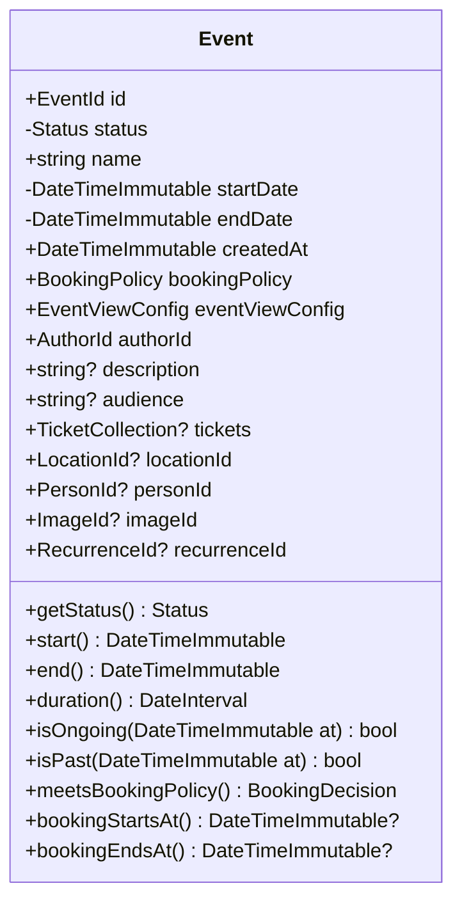

# Event Context

## Event

The Event class is the main entity of the event context. It represents an event in the system. It is used to store the event data in the database and to retrieve it from the database.

### Properties

